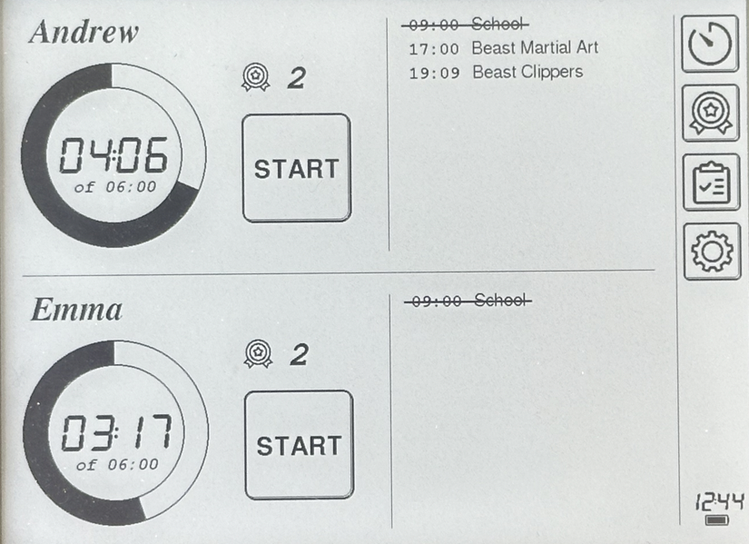
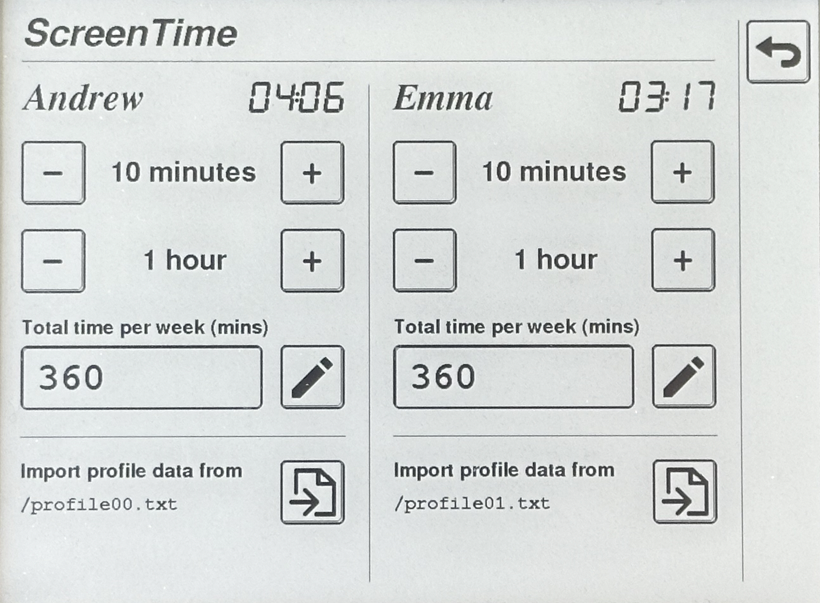
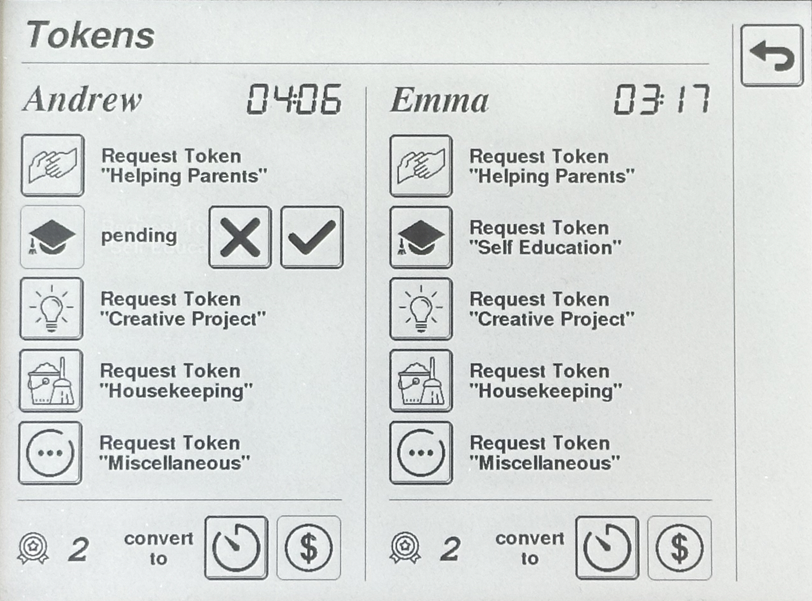
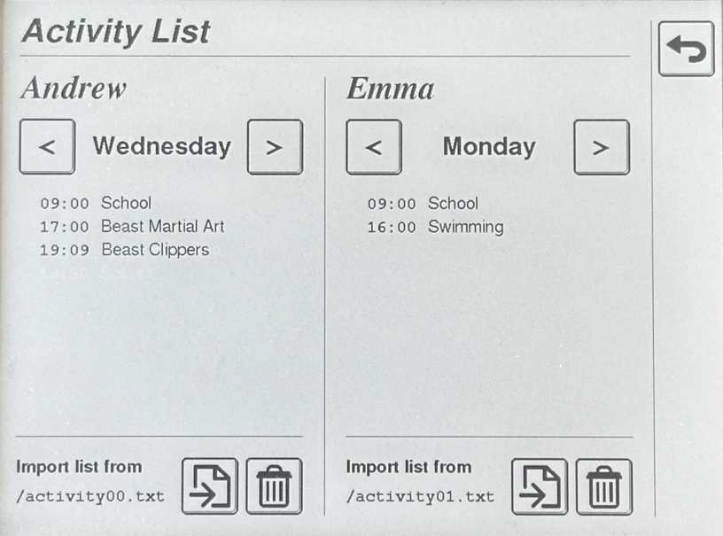
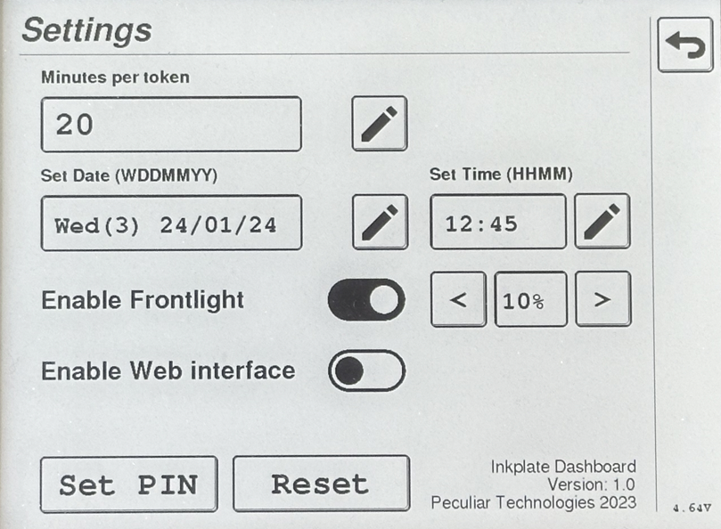

# User Manual

## Main Screen



Screentime ring is on a left, next to the button. 

Press **START** when screentime activity started and **STOP** when it finish. When active, inside the ring you can see current session time above remaining time and total time per week below. There is also a number of earned tokens above the button.

On a right there is a list of activities for today to help child to plan their time.

Finally, on the edge of a screen there is a menu (top to bottom): ScreenTime Control, Token Contol, Activity List Control, Settings.

## ScreenTime Control



Protected by PIN.
You can add or reduce existing screentime by adding/substracting 10 minutes or 1 hour. Total time per week can also be changed here.

Below you can find profile import button - there is an exact filename you should use for profile data on SD card (root folder).

Proile Data Format, simple TXT file (`profile0?.txt`):  
```
[ChildName]
total=hh:mm
```

**NOTE:** hours and minutes must have leading zero (6h - 06)

Example:
```
[Andrew]
total=06:00
```

## Token Control



On this screen child can request tokens for various activities. Tap on related category button to lodge request (it is possible to cancel request by tapping 'X' button).

When parent is ready to approve token, they tap 'V' button (PIN required).

At the very bottom of the page child can convert tokens into screen-time or money (TBD). Amount of minutes per token can be set in settings.

## Activity List Control



On this screen you can scroll and review all daily activities through the week.

Below you can remove all activities or import new ones (current ones will be overwritten).

To import activities there is an exact filename you should use for import data file on SD card (root folder).

Activity Data Format, simple TXT file (`activity0?.txt`):  
```
[Monday]
HH:MM|description

[Friday]
HH:MM|description
```

**NOTE:** hours must be in 24hour format (4pm - 16 etc)  

For example:

```
[Monday]
09:00|School

[Wednesday]
15:00|Swimming

[Friday]
17:30|Soccer
```

## Settings



You can find verious device settings on this screen.

To change amount of **Minutes per token** press edit button on a right, enter PIN and enter new value.

To change **Date**, press edit button on a left and enter value according to the following format:
```
input format: WDDMMYY

W: 0-Sun, 1-Mon, 2-Tue, 3-Wed, 4-Thu, 5-Fri, 6-Sat
DD: day, with leading zero
MM, month, with leading zero
YY, year - 2000

Wed, 24 Jan 2024 => 3240124
```

To change **Time**, press edit button on a left and enter value according to the following format:
```
input format: HHMM

HH - hours, 24-hours format with leading zero
MM - minutes, with leading zero

13:50 => 1350
```

You can also **Enable Frontlight** and change its brightness on a left.

**Enable Web interface** is not implemented yet.

At the very bottom you can **Set PIN** or **Reset Device** to "factory" settings (not implemented yet).

## Misc

* Currently screen-time rollover happens automatically on Monday, it is on a roadmap to support different weekday for that;
* When device is connected to desktop it is possible to observe runtime log by listening for device serial port (same port which is used to flash device with firmware);