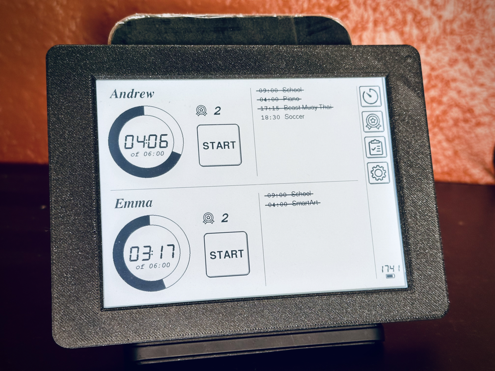

## Overview

**Inkplate Dashboard** is a simple screentime tracker with token and activity list support based on Inkplate 6plus.



### Does it even work?

You are gonna laugh, but "that depends" :)

Our kids love school token system - when they do something good, get tokens and exchange these to some personal activity time during a day.

Therefore, I have to admit, this ScreenTime Tracker only works for parents and kids who agree to play this game together and follow the rules.

### Known Issues

* Inkplate doesn't seem to have any sound peripheral, so there is no way to "beep" that time is out
* Profile and activity list must be crafted manually into `txt` file and imported through the menu
* No firmware installer (yet)
* Some bugs here and there

## Hardware

You can buy **Inkplate 6plus** from:
* [**CrowdSuppply**](https://www.crowdsupply.com/soldered/inkplate-6plus)
* [**soldered.com**](https://soldered.com/product/soldered-inkplate-6plus-with-enclosure-e-paper-display-with-touchscreen-usb-only/)

**NOTE:** you need to install CR2032 battery for RTC (Real Time Clock), many internal functions re

## Installing

- download zip firmware package from [**release page**](https://github.com/alexhude/InkplateDashboard/releases/latest/download/InkplateDashboard.zip)
- unpack it somewhere on you computer
- open terminal
- install **esptool.py** with `pip install esptool`
- find serial port allocated to your device (macOS ex. `/dev/cu.usbserial-14240`)
- go to the firmware folder (unpacked above)
- flash firmware over serial port with command:
```
esptool.py --chip esp32 --port "YOUT_DEVICE_PORT" --baud 460800 --before default_reset --after hard_reset write_flash -z --flash_mode dio --flash_freq 80m --flash_size detect 0x1000 ./bootloader_dio_80m.bin 0x8000 ./partitions.bin 0xe000 ./boot_app0.bin 0x10000 ./firmware.bin
```

## Quick Start

1. flash firmware as described above (see **Installation**)
2. get the smallest SD card
3. format SD card with FAT32
4. in root folder create `profile00.txt` import data per kid (00 - first child, 01 - second child)  

Import Data Format:  
```
[ChildName]
total=hh:mm
```

**NOTE:** hours and minutes must have leading zero (6h 30m => 06:30)

Example:
```
[Andrew]
total=06:00
```
5. insert SD card into device
6. turn device on (you will see only splitter lines and menu)
7. tap on settings menu
8. set time and date ("000" - default PIN)

Date example:
```
input format: WDDMMYY

W: 0-Sun, 1-Mon, 2-Tue, 3-Wed, 4-Thu, 5-Fri, 6-Sat
DD: day, with leading zero
MM, month, with leading zero
YY, year - 2000

Wed, 24 Jan 2024 => 3240124
```

Time example:
```
input format: HHMM

HH - hours, 24-hours format with leading zero
MM - minutes, with leading zero

13:50 => 1350
```
8. tap 'back' button (top right corner) to get to main screen
9. tap on ScreenTime menu (top right corner)
10. enter pin ("000" by default)
11. tap import profile for every child at the bottom of the screen
12. tap 'back' button (top right corner) to get to main screen

Congrats! You can go to settings now, change PIN, enable frontlight etc.

## Using

[**Quick Video Overview**](https://?/)

[**Manual**](./MANUAL.md)

## Building

Just clone this repo locally and use PlatformIO "Build" + "Upload" in your faviorite environment.
Personally I am using VSCode with PlatformIO extension, when repo is opened there it will be automatically configured.

Some useful `config.hpp` options:
* `CONFIG_VERBOSE_LOG` - enable verbose log `vlog()` messages (require `helper.hpp` included)
* `CONFIG_DEV_MODE_ON` - enable development mode (Dump diagnostics button in settings)

## Roadmap

* user friendly firmware installer
* UI for setting RTC date/time
* built-in webserver to configure everything remotely
* support screen-time rollover weekday other than Monday
* many more
